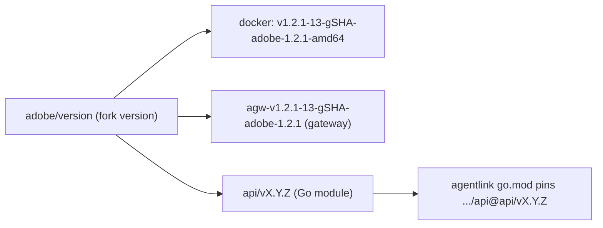

# Contributing to Adobe agentgateway

This is the contribution guide for **Adobe-Apis/agentgateway**, Adobe's
fork of [`agentgateway/agentgateway`](https://github.com/agentgateway/agentgateway),
maintained by the Ethos Gateway team.

For changes that should reach the public project, see upstream's
[`CONTRIBUTION.md`](../CONTRIBUTION.md) and open your PR against
`agentgateway/agentgateway`. It will reach this fork on the next sync.

## Pick the right home for your change

Ask first: **does this belong upstream?**

| Question | Answer |
|---|---|
| Generally useful to all agentgateway users? | Send **upstream**. It will reach `adobe` via the next sync. |
| Adobe-specific (IMS, internal infra, Envoy session conventions, GW signing, internal registry paths, etc.)? | Land it **here**, on `adobe`. |
| Unsure? | Default to upstream — easier to revert and re-apply later than to maintain a private patch indefinitely. |

The Ethos Gateway team owns merges to `adobe`. Upstream PRs follow the
public project's review process.

## Branching model

- **`adobe`** is the integration branch. All Adobe-bound PRs target it.
- Feature work lives on short branches off `adobe`. Name them how you
  like — `sync/*` is reserved for the upstream-sync automation; avoid
  that prefix for normal feature work.
- The fork stays linear: upstream commits sit at the base with their
  verbatim SHAs, Adobe commits stack on top. See
  [`../.claude/skills/agentgateway-sync/references/merge-strategies.md`](../.claude/skills/agentgateway-sync/references/merge-strategies.md)
  for the rationale.
- Keep PRs small and focused. Prefer **Squash and merge** so each PR
  lands as one `adobe:` commit on top of the upstream base. Per-commit
  history on the feature branch is disposable; the fork's linear shape
  (verbatim upstream SHAs + Adobe commits on top) is maintained by the
  sync skill, not by how feature PRs are merged.

## Code conventions

See [`CONVENTIONS.md`](CONVENTIONS.md) for the full set. Essentials:

- **Gate Adobe-only logic** with `#[cfg(feature = "adobe")]`. Tests
  covering Adobe-only behavior go behind the same flag.
- **Protected files** — touch with care, run the `check-patches` skill
  after any non-trivial change:
  - `crates/agentgateway/src/http/jwt.rs` (IMS-aware JWT validation)
  - `crates/agentgateway/src/mcp/sse.rs` (`mcp-session-id` header)
  - everything under `adobe/`
- **Prefer small modules** under `adobe/` for tooling that should never
  compile into upstream.
- Adobe container builds set `CARGO_BUILD_FEATURES=ui,adobe`. Validate
  locally with `cargo test --features ui,adobe`.

## Commit messages

Every Adobe-authored commit carries an `adobe:` prefix so the fork's
contribution is visually distinct from cherry-picked upstream history.

Pattern: `adobe: [<sub-area>:] <subject>`

Examples:

- `adobe: jwt: validate expires_in/created_at`
- `adobe: mcp/sse: add mcp-session-id response header`
- `adobe: makefile: add amd64 release target`
- `adobe: release X.Y.Z`

Lowercase. No trailing period in the subject. Reference Adobe-Apis PR
numbers as `(#N)` when relevant. Wrap bodies at 72–80 characters.

## Releases

Releases are author-driven and cut manually (there is no release CI on the
fork yet). When your PR ships a release:

1. **Bump the fork version.** Update `adobe/version` to the new `X.Y.Z`
   and append a `## X.Y.Z` section to `adobe/CHANGELOG.md` with the
   relevant bullets. Use the `changelog-entry` skill to draft the bullets.
2. **Merge into `adobe`**, then build and publish the Docker image (see
   below). The image tag is
   `…/agentgateway:vUPSTREAM-N-gSHA-adobe-X.Y.Z-amd64`.
3. **Cut release tags and publish a GitHub Release** on the release commit
   (clean working tree). Requires `gh` authenticated against
   `Adobe-Apis/agentgateway` with SSO authorized (`gh auth login`, or a
   GHEC token). The Makefile strips stray `GITHUB_TOKEN`/`GH_TOKEN` from
   the environment automatically so `gh` uses your keyring login.

   ```bash
   make -C adobe cut-release-tags
   ```

   This creates and pushes two annotated tags at `HEAD`, then publishes a
   [GitHub Release](https://github.com/Adobe-Apis/agentgateway/releases)
   on the gateway tag:

   - `agw-<upstream-describe>-adobe-X.Y.Z` — gateway release tag (mirrors
     the docker image tag minus `-amd64`); gets the GitHub Release page
   - `api/vX.Y.Z` — Go module tag for
     `github.com/Adobe-Apis/agentgateway/api` (consumed by agentlink via
     `go get …/api@api/vX.Y.Z`)

   The release body is the curated `## X.Y.Z` section from
   `adobe/CHANGELOG.md`, plus a **Full Changelog** compare link to the
   previous `agw-*` release when one exists. Tags that already exist on
   `origin` are skipped (e.g. `api/vX.Y.Z` when the Go module types did
   not change since the last release). The GitHub Release is also skipped
   if one already exists for the gateway tag.

   Preview tag names with `make -C adobe print-release-tags` or the
   release body with `make -C adobe print-release-notes`. To create tags
   locally without pushing, use `PUSH=0 make -C adobe cut-release-tags`.
   To skip the GitHub Release while still pushing tags, use
   `RELEASE=0 make -C adobe cut-release-tags`. If tags are already on
   origin but the release failed, re-run `make -C adobe create-release`.

4. **Non-release PRs leave `adobe/version` and `adobe/CHANGELOG.md`
   alone.** Mid-cycle PRs (bug fixes, refactors, infra) don't bump the
   version. Only the PR that's "the release" does.

### Release invariants

Conventions the release cutter should follow (future CI, if added, should
enforce these):

- `cat adobe/version` equals the most recent `## X.Y.Z` heading in
  `adobe/CHANGELOG.md`.
- For every `## X.Y.Z` heading, there is a corresponding annotated
  gateway tag `agw-<upstream-describe>-adobe-X.Y.Z` and Go module tag
  `api/vX.Y.Z` (the upstream-describe prefix is dynamic and not recorded
  in the CHANGELOG).
- Each release tag points at a commit where `cat adobe/version` returns
  `X.Y.Z`.
- Treat all release tags as immutable — never move or delete them.

### Tag scheme

All release artifacts derive from the single fork version in
`adobe/version`:



- **Gateway releases** use `agw-<upstream-describe>-adobe-X.Y.Z`
  annotated tags (e.g. `agw-v1.2.1-13-g321e5485-adobe-1.2.1`). The
  `agw-` prefix keeps these inert against the upstream
  `.github/workflows/release.yml` trigger (`v*.*.*`) and against
  `git describe --match 'v*'`.
- **Go module releases** use `api/vX.Y.Z` annotated tags for the
  `github.com/Adobe-Apis/agentgateway/api` submodule (subdir-prefixed
  per Go module rules).
- **Upstream `v*` tags** are preserved verbatim from `public/main`;
  never re-tag or rename them.
- `adobe/Makefile` derives `UPSTREAM_VERSION` from `git describe --match
  'v*'`, so adding `agw-*` or `api/*` tags never disturbs the
  upstream-version lookup.

## Pull request expectations

- PRs target `adobe`.
- CI runs the upstream test matrix plus Adobe-specific checks when
  `adobe/version` or `adobe/CHANGELOG.md` changes.
- Reviews require at least one approval from the Ethos Gateway team.
  Changes touching protected files (`jwt.rs`, `mcp/sse.rs`, `adobe/`)
  may need a second reviewer at the team's discretion.
- After approval, the PR author (or a maintainer) merges. If the merge
  bumps `adobe/version`, cut release tags with `make -C adobe
  cut-release-tags` after publishing the docker image.

## Upstream sync (separate workflow)

You shouldn't need to run a sync as part of a regular feature PR. If
your work depends on a recent upstream commit, ping the Ethos Gateway
team and a maintainer will trigger the
[`agentgateway-sync`](../.claude/skills/agentgateway-sync/SKILL.md) skill.

The skill rebases Adobe-only commits onto each new upstream commit,
opens a `sync/*` PR, and waits for a `/land` comment from a maintainer
to force-update `adobe`. It is the only path by which `adobe` should
gain upstream content.

## Questions

Open a GitHub issue, or reach out internally to the Ethos Gateway team.
